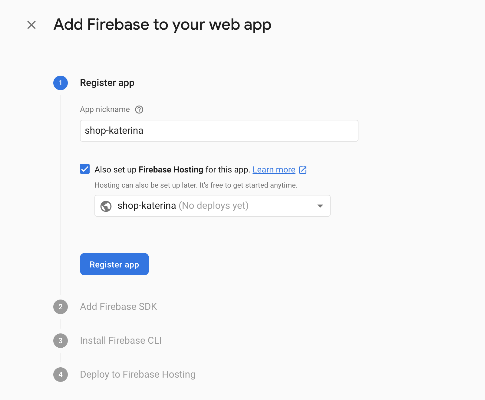
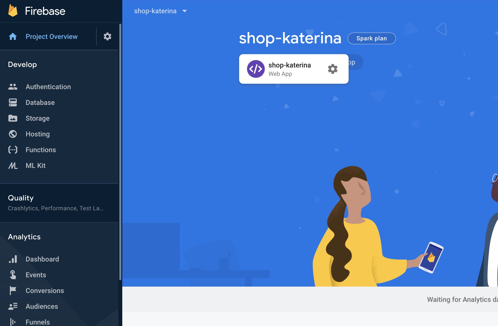
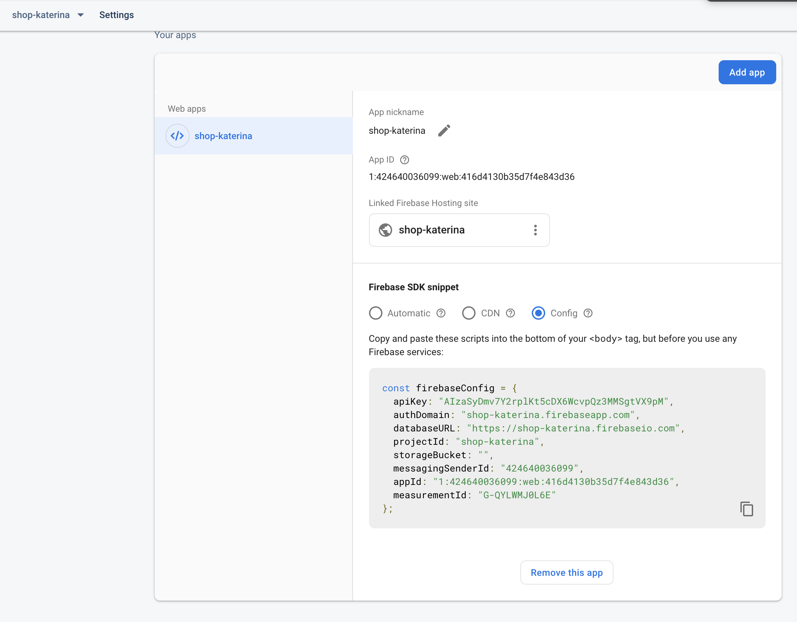

# Step02 - Set up Firebase (in console and in Angular)

[previous step](Step01.md) <----> [next step](Step03.md) | [home](../README.md)

## Creating an account on Firebase

1. Go to [firebase.google.com/](https://firebase.google.com/) and sign in with your
   google account (if you don't have a google account, kindly create one).
2. Go to the Firebase [console](https://console.firebase.google.com/) and
   create a new project.
3. Get familiar with the Firebase console and its parts!

## Install @angular/fire

Now, let us add the [@angular/fire](https://github.com/angular/angularfire2) library
to our project, the library that will help
us use Firebase functions in our Angular project.
In your terminal type:

```
npm install firebase @angular/fire --save
```

## Setting up Firebase in our Angular app

Now, we need to set up Firebase in our Angular application.
Since this is not an Angular workshop, we'll skim through this, just so you can see how it works, and be able to
set it up in the project we'll build today.
In any case, we are going to be using another repo for our workshop today!

Open the file `src/app/app.module.ts`.

1. On the top of the file, copy and paste the following imports:

```
import { AngularFireModule } from '@angular/fire';
```

2.  Open your `environments/` directory. This contains two separate files, `environment.ts` and `environment.prod.ts`. These files can contain
    contants/parameters that are specific to your app's environment. The `environment.ts` file is used every time you run `ng serve` for local
    testing. When you want to build your app for production, you run `ng serve --prod` and this will replace the `environment.ts` file with
    `environment.prod.ts`.

        __Note:__
        Why would you want that? Maybe you are using a different environment for testing and for production, and these environment
        files (which can be as many as you want) can create different builds to use in different deployments, in case you want an app with a single codebase
        but different parameters for different clients, for example. The specification of which environment to build into which application is set in
        `angular.json` and if you want we can talk about it.

For the time being, in both your environment files add a new attribute called firebase:

```
firebase: {
    apiKey: <YOUR_API_KEY>,
    authDomain: "YOUR_PROJECT_ID.firebaseapp.com",
    databaseURL: "https://YOUR_PROJECT_ID.firebaseio.com",
    projectId: "YOUR_PROJECT_ID",
    storageBucket: "YOUR_PROJECT_ID.appspot.com",
    messagingSenderId: <YOUR_MESSAGESENDER_ID>
}
```

All this information is available in the _Project Overview_ tab of your project
in the Firebase Console.
In the _Get Started_ section, if you click on the web app icon, you will find the
configuration parameters of your project:




This is the information that will connect your application with the project we just created in the Firebase console. You will need to do that
when you clone the ready-made app, to connect it to your project!

3. Within the `@NgModule`, modify the imports array like this:

```
imports: [
  BrowserModule,
  AngularFireModule.initializeApp(environment.firebase)
]
```

And now you are ready to go!
Firebase is all set up!

**Note:**

This is just showing how you will use the configuration settings taken from the firebase console in your app.
We will not go deeper into using `@angular/fire` or `angular`, since this is not the topic of this workshop. You will
just need this knowledge to set up your app in the next video.

[previous step](Step01.md) <----> [next step](Step03.md) | [home](../README.md)
